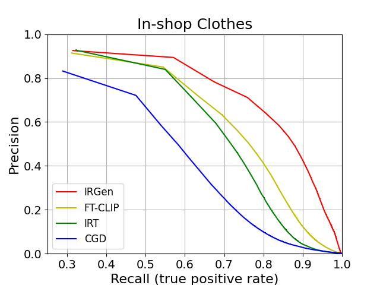
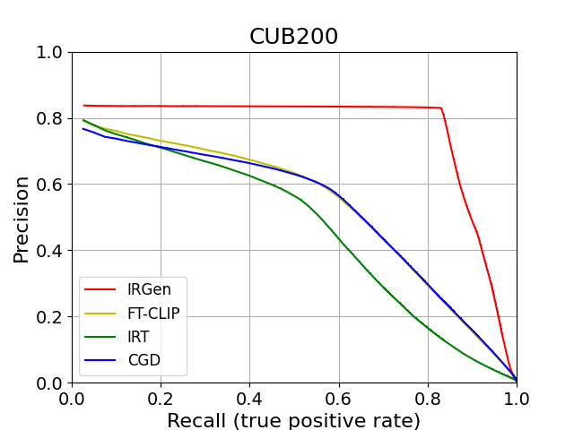
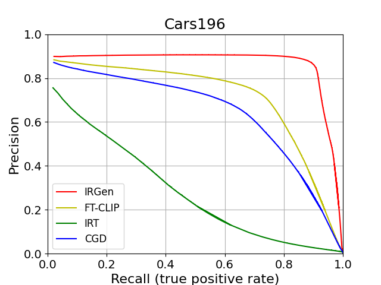

# IRGen
A PyTorch implementation of IRGen based on the paper [IRGen: Generative Modeling for Image Retrieval](https://arxiv.org/abs/2303.10126).


## Requirements
- [Anaconda](https://www.anaconda.com/download/)
- [PyTorch](https://pytorch.org)
```
conda install pytorch torchvision cudatoolkit=10.0 -c pytorch
pip install -r requirements.txt
```

## Datasets
[CARS196](http://ai.stanford.edu/~jkrause/cars/car_dataset.html), [CUB200-2011](http://www.vision.caltech.edu/visipedia/CUB-200-2011.html) and
[In-shop Clothes](http://mmlab.ie.cuhk.edu.hk/projects/DeepFashion/InShopRetrieval.html) are used in this repo.

You should download these datasets by yourself, and extract them into `data/car`, `data/cub`, `data/isc` directory. For each dataset, run the following instruction to generate the ground truth file.
```
python gnd_generater.py 
```

## Usage
### Train Tokenizer
```
python train_tokenizer.py 
optional arguments:
--data_path                   datasets path [default value is 'data']
--data_name                   dataset name [default value is 'isc'](choices=['car', 'cub', 'isc', 'imagenet', 'places'])
--feats                       initialize features for quantize [default value is '']
--output_dir                  saving output direction [default value is 'results']
--lr                          train learning rate [default value is 5e-4]
--batch_size                  train batch size [default value is 128]
--num_epochs                  train epoch number [default value is 200]
--rq_weight                   loss weight for rq reconsturcted features
```
### Get image tokens
```
python rq.py --features 'isc_features.npy' --file_name 'isc_rq.pkl' --data_dir 'data/isc'
optional arguments:
--data_name                   dataset name [default value is 'isc'](choices=['car', 'cub', 'isc', 'imagenet', 'places'])
```
### Train IRGen
```
python -m torch.distributed.launch --nproc_per_node=8 train_ar.py --file_name 'in-shop_clothes_retrieval_trainval.pkl' --codes 'isc_rq.pkl'
optional arguments:
--data_dir                    datasets path [default value is 'data/isc/Img']
--data_name                   dataset name [default value is 'isc'](choices=['car', 'cub', 'isc', 'imagenet', 'places'])
--output_dir                  saving output direction [default value is 'results']
--lr                          train learning rate [default value is 8e-5]
--batch_size                  train batch size [default value is 64]
--num_epochs                  train epoch number [default value is 200]
--smoothing                   smoothing value for label smoothing [default value is 0.1]
```

### Test IRGen
```
python test_ar.py --file_name 'in-shop_clothes_retrieval_trainval.pkl' --codes 'isc_rq.pkl' --model_dir 'results/isc_rq_e200.pkl' 
optional arguments:
--data_dir                    datasets path [default value is 'data/isc/Img']
--data_name                   dataset name [default value is 'isc'](choices=['car', 'cub', 'isc', 'imagenet', 'places'])
--beam_size                   size for beam search [default value is 30]
--ks                          query number for test@k[default value is [1,10,20,30]]
```

## Benchmarks
The models are trained on 8 NVIDIA Tesla V100 (32G) GPU. 

### In-shop
P refers to precision, R refers to recall.
<table>
  <thead>
    <tr>
      <th>P@1</th>
      <th>P@10</th>
      <th>P@20</th>
      <th>P@30</th>
      <th>R@1</th>
      <th>R@10</th>
      <th>R@20</th>
      <th>R@30</th>
    </tr>
  </thead>
  <tbody>
    <tr>
      <td align="center">92.4%</td>
      <td align="center">87.4%</td>
      <td align="center">87.0%</td>
      <td align="center">86.9%</td>
      <td align="center">92.4%</td>
      <td align="center">96.8%</td>
      <td align="center">97.6%</td>
      <td align="center">97.9%</td>
    </tr>
  </tbody>
</table>

### CUB200 
<table>
  <thead>
    <tr>
      <th>P@1</th>
      <th>P@2</th>
      <th>P@4</th>
      <th>P@8</th>    
      <th>R@1</th>
      <th>R@2</th>
      <th>R@4</th>
      <th>R@8</th>
    </tr>
  </thead>
  <tbody>
    <tr>
      <td align="center">82.7%</td>
      <td align="center">82.7%</td>
      <td align="center">83.0%</td>
      <td align="center">82.8%</td>
      <td align="center">82.7%</td>
      <td align="center">86.4%</td>
      <td align="center">89.2%</td>
      <td align="center">91.4%</td>
    </tr>
  </tbody>
</table>

### CARS196 
<table>
  <thead>
    <tr>
      <th>P@1</th>
      <th>P@2</th>
      <th>P@4</th>
      <th>P@8</th>    
      <th>R@1</th>
      <th>R@2</th>
      <th>R@4</th>
      <th>R@8</th>
    </tr>
  </thead>
  <tbody>
    <tr>
      <td align="center">90.1%</td>
      <td align="center">89.9%</td>
      <td align="center">90.2%</td>
      <td align="center">90.5%</td>
      <td align="center">90.1%</td>
      <td align="center">92.1%</td>
      <td align="center">93.2%</td>
      <td align="center">93.7%</td>
    </tr>
  </tbody>
</table>


## Results
The Precision-Recall curve.
### In-shop Clothes



### CUB200



### Cars196


